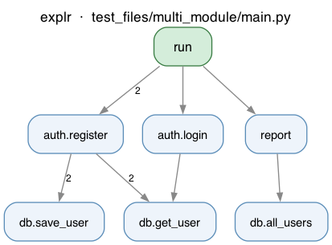

# explr

Trace any Python process and generate a clean call graph diagram.

```
explr myscript.py
```



---

## How it works

`explr` injects Python's `sys.settrace` into your script at runtime, records every function call, filters out noise (stdlib, dunders, private functions), and renders a top-to-bottom flow diagram showing how control moves through your code.

---

## Installation

### Prerequisites

`explr` requires **Graphviz** to render diagrams. Install it for your OS:

| OS | Command |
|---|---|
| macOS (Homebrew) | `brew install graphviz` |
| Ubuntu / Debian | `sudo apt install graphviz` |
| Fedora / RHEL | `sudo dnf install graphviz` |
| Windows | [Download installer](https://graphviz.org/download/) — make sure `dot` is added to PATH |

### Install explr

```bash
pip install -e .
```

Or with uv:

```bash
uv pip install -e .
```

> **Note:** Use `--no-build-isolation` if your environment already has setuptools:
> ```bash
> pip install -e . --no-build-isolation
> ```

---

## Usage

```
explr [options] <target> [target-args ...]
```

### Basic examples

```bash
# Trace a .py file
explr myscript.py

# Trace with the python prefix (same result)
explr python myscript.py
explr python3 myscript.py

# Pass arguments through to your script
explr myscript.py --config dev

# Trace a module-style tool (e.g. pytest, flask)
explr pytest tests/
explr python -m mypackage
```

### Options

| Flag | Description |
|---|---|
| `--depth N` | Limit call depth (default: unlimited) |
| `--no-stdlib` | Skip tracing stdlib calls (faster, same visual result) |
| `--output NAME` | Override output filename (no extension needed) |

```bash
explr --depth 5 myscript.py
explr --no-stdlib myscript.py
explr --output my_graph myscript.py
```

### Output

Diagrams are saved to `./explr_diagrams/` in the current working directory:

```
explr_diagrams/
  myscript_diagram.png
```

- Green nodes = entry points (called from top-level code)
- Blue nodes = regular functions
- Edge labels = number of times that call was made

---

## What gets shown

| Included | Excluded |
|---|---|
| User-defined functions | stdlib functions |
| Cross-module calls | Dunder methods (`__init__`, etc.) |
| Recursive calls (self-loops) | Private functions/modules (leading `_`) |
| Class methods | Synthetic names (`<listcomp>`, `<lambda>`, etc.) |

If no user-defined function calls are found (e.g. a script with only top-level expressions), no diagram is created.

---

## Test files

The `test_files/` directory contains examples covering common patterns:

```bash
explr test_files/simple.py          # linear call chain
explr test_files/recursive.py       # recursive functions
explr test_files/classes.py         # class methods
explr test_files/branching.py       # conditional branches
explr test_files/multi_module/main.py  # calls across multiple files
explr test_files/no_calls.py        # no diagram (expected)
```

---

## Project structure

```
explr/
  cli.py        # entry point, argument parsing, process detection
  tracer.py     # sys.settrace bootstrap and subprocess runner
  renderer.py   # graphviz diagram rendering
  models.py     # CallNode / CallEdge / CallGraph dataclasses
test_files/     # example scripts for testing
pyproject.toml
```
