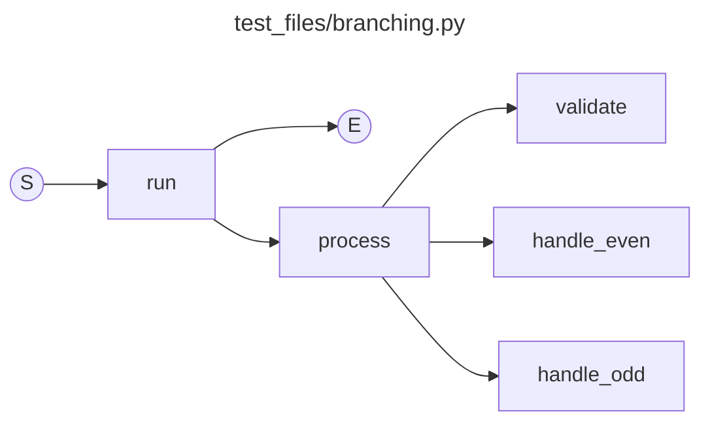

# explr

Trace any Python process and generate a clean call graph diagram.

Best suited for debugging small-to-medium synchronous Python programs (for now).

> **Recommended defaults:** use `--mermaid --local` for the cleanest results — Mermaid renders directly in VS Code and GitHub, and `--local` filters out everything except your own code.




[Example PNG Diagram](https://github.com/omavashia2005/explr/blob/main/explr_diagrams/t6_cross_module_diagram.png)

[Example Mermaid Diagram](https://github.com/omavashia2005/explr/blob/main/explr_diagrams/mermaid/main_diagram.mmd)


## How it works

`explr` injects Python's `sys.settrace` at runtime, records every function call, filters out noise (stdlib, dunders, private functions), and renders a flow diagram showing how control moves through your code.

The diagram has a **horizontal spine** of entry points in execution order, with each node's sub-calls hanging below it:

```
(S) → run → (E)
       ├── auth.register → db.save_user
       │                 → db.get_user
       ├── auth.login    → db.get_user
       └── report        → db.all_users
```

- **S / E** = start and end of execution
- **Green nodes** = entry points (called from top-level code), in the order they ran
- **Blue nodes** = sub-calls


## Installation

### Prerequisites

The default PNG output requires **Graphviz**. Install it for your OS:

| OS | Command |
|---|---|
| macOS (Homebrew) | `brew install graphviz` |
| Ubuntu / Debian | `sudo apt install graphviz` |
| Fedora / RHEL | `sudo dnf install graphviz` |
| Windows | [Download installer](https://graphviz.org/download/) — make sure `dot` is added to PATH |

> If you only want Mermaid (`.mmd`) output, Graphviz is not required.

### Install explr

```bash
pip install explr
```


## CLI usage

```
explr [options] <target> [target-args ...]
```

### Examples

```bash
# Recommended: clean output, no Graphviz needed
explr --mermaid --local myscript.py

# Trace with the python prefix (same result)
explr python myscript.py
explr python3 myscript.py

# Pass arguments through to your script
explr --mermaid --local myscript.py --config dev

# Trace a module-style tool (e.g. pytest, flask)
explr --mermaid --local pytest tests/
explr --mermaid --local python -m mypackage

# Trace any shell command that resolves to Python
# (PATH scripts, shell aliases, shell functions)
explr --mermaid --local my_tool --some-arg
```

### Resolving shell commands

`explr` automatically resolves commands that aren't directly a Python file or interpreter.
It walks the following chain until it finds a Python target:

1. **PATH scripts** — executable files with a `#!/usr/bin/env python3` shebang
2. **Shell aliases** — e.g. `alias my_tool='python3 /path/to/tool.py'`
3. **Shell functions** — defined in your `.bashrc` / `.zshrc`
4. **Wrapper scripts** — shell scripts that `exec python3 ...` internally

```bash
# If 'mtgs_viewer' is a shell alias for 'python3 viewer.py --theme dark':
explr mtgs_viewer

# explr prints what it resolved to:
# [explr] resolved 'mtgs_viewer' → viewer.py (extra args: ['--theme', 'dark'])
```

### Options

| Flag | Description |
|---|---|
| `--mermaid` / `--mmd` | ⭐ Output a Mermaid flowchart (`.mmd`) instead of a PNG |
| `--local` | ⭐ Only show your own code — excludes stdlib and third-party packages |
| `--depth N` | Limit call depth (default: unlimited) |
| `--no-stdlib` | Skip tracing stdlib frames (faster; implied by `--local`) |
| `--output NAME` | Override output filename (no extension needed) |

```bash
# Recommended: cleanest output, no Graphviz needed, works in VS Code + GitHub
explr --mermaid --local myscript.py

explr --depth 5 myscript.py
explr --output my_graph myscript.py
```

### Output formats

**Default — PNG** (requires Graphviz):
```
explr_diagrams/
  myscript_diagram.png
```

**Mermaid** (`--mermaid`):
```
explr_diagrams/
  myscript_diagram.mmd
```

The `.mmd` file contains a standard [Mermaid](https://mermaid.js.org) flowchart that renders in:
- VS Code (Markdown preview / Mermaid extension)
- GitHub Markdown (fenced ` ```mermaid ` blocks)
- [mermaid.live](https://mermaid.live) — paste and view instantly


## Python API

Trace a specific function from within your own code using `explr.trace()`. Works with both **sync and async** functions.

```python
import explr

# Sync function
explr.trace(my_function, args=(1, 2))

# Async function — explr handles the event loop automatically
explr.trace(my_async_function, kwargs={"url": "...", "headers": {}})

# With keyword args
explr.trace(my_function, args=(x,), kwargs={"flag": True})

# All options
explr.trace(
    my_function,
    args=(x,),
    output="my_graph",   # custom output filename (no extension)
    depth=5,             # limit call depth
    no_stdlib=True,      # skip stdlib frames (faster)
)

# Returns the path to the generated PNG (or None if nothing was captured)
path = explr.trace(my_function, args=(x,))
```

Diagrams are written to `./explr_diagrams/<func_name>_diagram.png` (or your `output` name).

`explr.trace()` runs entirely in-process using `sys.settrace` — no subprocess or temp files. Any existing trace hook is saved and restored around the call.

### Async functions

For async functions, `explr.trace()` automatically runs the coroutine via `asyncio.run()`. Mock out any network/IO calls so the function executes without side effects:

```python
import explr

# Mock the network call
async def fetch(url, headers):
    return b"mock response"

async def my_pipeline(url: str, headers: dict):
    raw = await fetch(url=url, headers=headers)
    result = process(raw)
    return result

explr.trace(
    my_pipeline,
    kwargs={"url": "https://example.com", "headers": {}},
    output="my_pipeline",
    no_stdlib=True,
)
```

> **Jupyter / running event loop:** `asyncio.run()` cannot be called from inside an already-running loop. Install `nest_asyncio` to work around this:
> ```bash
> pip install nest_asyncio
> ```
> ```python
> import nest_asyncio
> nest_asyncio.apply()
> explr.trace(my_async_function, kwargs={...})
> ```

---

## What gets shown

| Included | Excluded |
|---|---|
| User-defined functions | stdlib functions |
| Cross-module calls | Dunder methods (`__init__`, etc.) |
| Recursive calls (self-loops) | Private functions/modules (leading `_`) |
| Class methods | Synthetic names (`<listcomp>`, `<lambda>`, etc.) |

If a function has no user-defined sub-calls, it still appears on the spine as `S → fn → E`.

---

## Test files

The `test_files/` directory contains examples covering common patterns:

```bash
explr --mermaid --local test_files/simple.py             # linear call chain
explr --mermaid --local test_files/recursive.py          # recursive functions
explr --mermaid --local test_files/classes.py            # class methods
explr --mermaid --local test_files/branching.py          # conditional branches
explr --mermaid --local test_files/multi_module/main.py  # calls across multiple files
explr --mermaid --local test_files/no_calls.py           # no sub-calls (spine only)
```

---

## Project structure

```
explr/
  __init__.py   # explr.trace() Python API
  cli.py        # entry point, argument parsing, command resolution
  tracer.py     # sys.settrace bootstrap (CLI), in-process tracer (API), shell resolution
  renderer.py   # graphviz PNG and Mermaid diagram rendering
  models.py     # CallNode / CallEdge / CallGraph dataclasses
test_files/     # example scripts for testing
pyproject.toml
```
